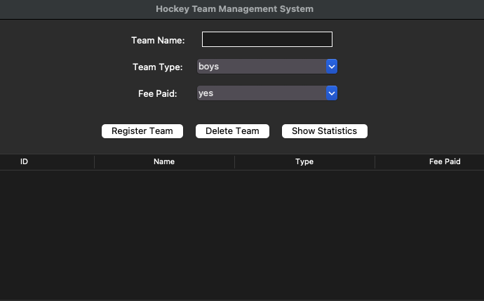

# Hockey Team Manager

## Application Preview


A Python desktop application for managing hockey teams using OOP and Tkinter GUI.

## Features

- Register new teams
- Display teams in a table
- Delete teams
- View statistics
- Input validation
- GUI built with Tkinter
- CLI version included

## Run the GUI

```
python3 gui.py
```

## Run the CLI version

```
python3 main.py
```

## Technologies

- Python
- Tkinter
- Object-Oriented Programming